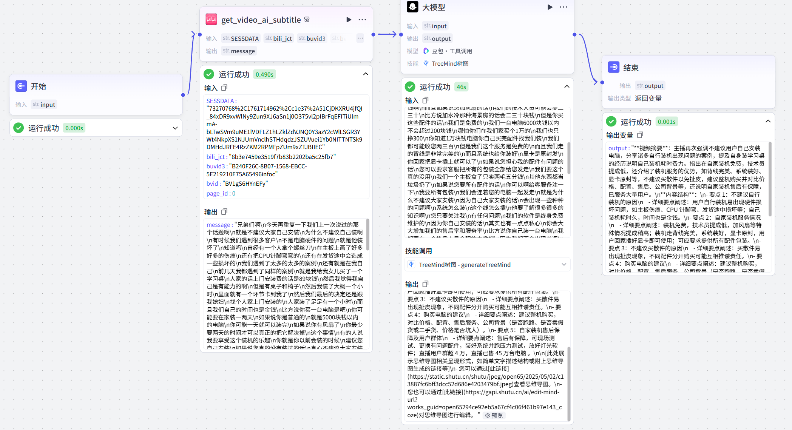
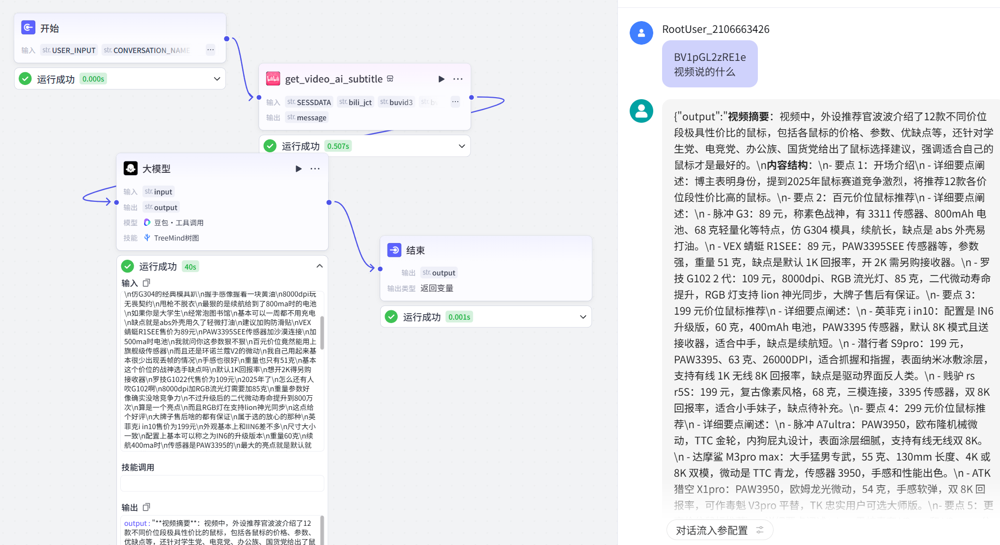
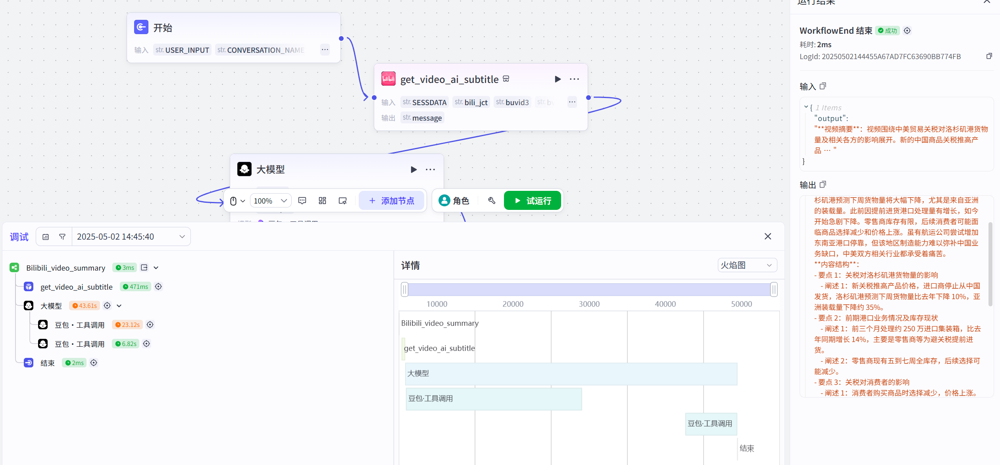
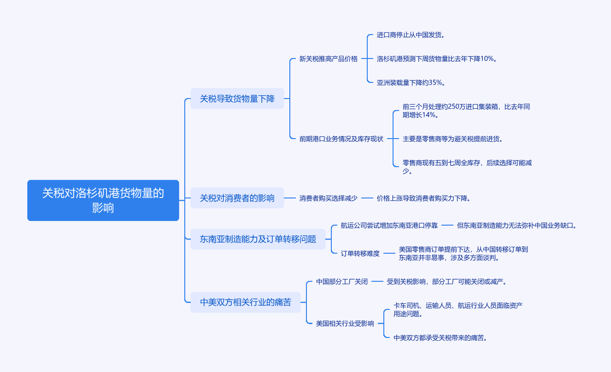
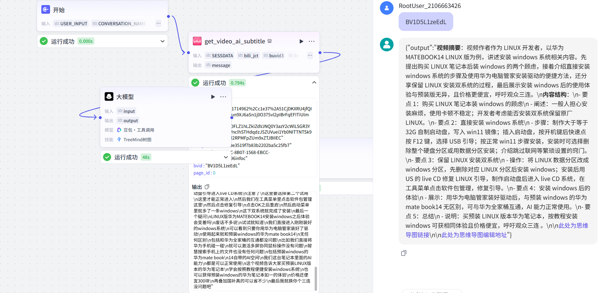
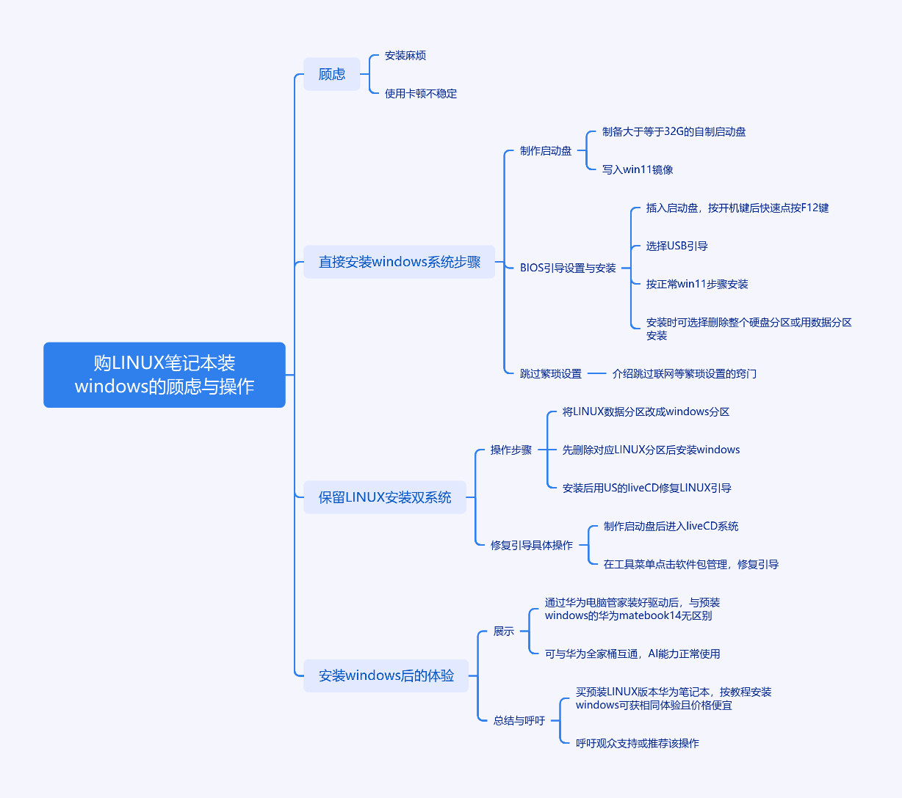

项目成员：何思宇22050219
## 作业题目
分析B站视频内容并提取摘要和划分结构输出，生成思维导图的工作流。
项目结构如下

## 引言

B站作为以年轻用户为核心的多元化视频平台，内容覆盖游戏、教育、科技、生活等领域，日均视频上传量庞大。随着用户基数增长，创作者面临激烈竞争，亟需工具快速定位优质内容方向、优化创作策略。传统的视频分析依赖人工观看与经验判断，效率低且难以应对海量数据的结构化处理需求。因此，我制作了AI读取视频内容的工作流，它可以分析B站视频内容并提取摘要和划分结构输出，还能生成思维导图，减少了读者观看视频的时间。

## 作业内容
本工作流是一个专为B站视频设计的自动化处理链路，通过四个主要步骤将视频内容转化为结构化的文字摘要与思维导图。整个流程完全基于用户提供的BV号展开操作，不涉及人工干预，以下是具体运行过程的详细描述。

第一步：启动与输入  
工作流起始于一个标有"开始"的圆形节点。用户在此处输入需要分析的B站视频专属标识——BV号（例如"BV1GJ4m1w7ZR"）。这个由字母和数字组成的编号如同视频的身份证，帮助系统精准定位目标内容。输入完成后，流程沿着蓝色箭头进入下一个处理模块。

第二步：获取视频字幕  
系统进入名为"get_video_ai_subtitle"的矩形处理节点。该模块根据输入的BV号，向B站服务器发起请求并获取视频的自动生成字幕。在此过程中需要验证操作权限，因此系统会自动携带三个关键参数：  
• SESSDATA：保持登录状态的验证信息

• bili_Jct：用于确认用户身份的令牌

• buvid3：标识设备特征的编码

这些加密字符就像打开保险柜的密码组合，确保系统拥有合法获取字幕的权限。成功获取数据后，模块会输出两大部分内容：包含时间轴信息的完整字幕文本（"message"字段），以及用于后续操作的系统验证参数。

第三步：智能内容分析  
携带字幕数据的工作流进入"大模型"节点，这里部署着DeepSeek-R1智能分析引擎。该模型采用渐进式处理策略：首先通读全部字幕文本，像经验丰富的编辑那样划出重点段落；接着识别内容的内在逻辑关系，将视频分解为"引言-核心内容-总结"等结构模块；最后提炼出包含核心观点的摘要文字。例如分析科普类视频时，模型能准确分离出"现象描述-原理阐释-应用实例"的典型结构。

处理完成后，该节点输出两个成果物：经过整理的结构化文本（"output"字段）和包含分析逻辑的中间数据（"reasoning_content"字段）。这些数据通过标准化接口传递给最终环节。

第四步：可视化呈现  
工作流抵达"TreeMind树图"节点，这是整个流程的收尾阶段。系统将接收到的结构化文本送入树图插件，自动生成层级分明的思维导图。导图构建过程遵循内容结构特征：视频主旨作为中心主题，分论点呈放射状延伸，具体论据则通过分支细化展示。导图支持展开/收起交互功能，用户点击任意节点即可查看对应的详细说明文字。

流程终点  
当思维导图生成完毕，工作流通过"结束"节点完成整个处理周期。系统将所有输出结果打包返回，包括可直接查看的摘要文档、思维导图文件，以及用于技术对接的结构化数据。整个过程各节点通过蓝色连接线形成完整闭环，浅灰色背景使操作流向清晰可辨。

该工作流的设计突出链条化特征：每个环节严格接收前序节点的输出数据，处理过程不产生额外信息，确保结果完全基于原始字幕内容生成。从输入BV号到获取最终成果，所有操作均在系统内部自动完成，形成标准化的视频解析解决方案。
### 注意事项说明

#### 1. ​**​敏感信息处理​**​

- ​**​Cookie参数时效性​**​：流程中所需的 `SESSDATA` 和 `bili_Jct` 需从浏览器Cookie中手动复制（需登录B站后通过开发者工具获取）。这两项参数具有 ​**​24-48小时有效期​**​，过期后需重新登录B站并更新输入，否则流程会因权限失效而中断。
- ​**​实时输入要求​**​：切勿提前保存或复用历史Cookie值，每次运行前务必通过输入框粘贴最新参数（参考图中"输入"字段的 `str.` 格式要求）。
#### 2. ​**​流程执行限制​**​

- ​**​字幕依赖风险​**​：`get_video_ai_subtitle` 模块仅能解析B站 ​**​官方自动生成的字幕​**​，若视频未开启AI字幕功能（如用户自行上传外挂字幕），该环节将返回空数据，导致后续流程失败。
- ​**​输入格式规范​**​：确保输入的BV号为 ​**​完整且未变形​**​ 的字符串（如 `BV1GJ4m1w7ZR`），包含字母大小写和特殊符号需与网页地址栏完全一致，避免因格式错误触发流程终止。
#### 3. ​**​结果可靠性​**​

- ​**​字幕质量影响​**​：若视频语音含方言、专业术语或背景杂音，AI生成的字幕可能出现错别字或断句异常，导致大模型（DeepSeek-R1）分析的摘要或结构划分偏差。
- ​**​思维导图适配性​**​：`TreeMind树图` 插件生成的导图层级深度固定为三级，若视频内容结构复杂（如超过5个主论点），需手动调整节点布局以确保可读性。

#### 4. ​**​操作环境要求​**​

- ​**​网络稳定性​**​：获取字幕环节需直连B站服务器，若检测到代理或VPN可能导致IP被封禁。建议在 ​**​低延迟网络环境​**​ 下运行（延迟＜200ms）。​
- ​**​设备绑定限制​**​：`buvid3` 参数与设备硬件特征绑定，若更换电脑或浏览器运行流程，需重新获取该参数，否则可能触发B站风控机制。
- ​**​浏览器依赖​**​：Cookie提取仅支持Chrome/Firefox等主流浏览器，部分国产浏览器（如360）的加密Cookie可能无法被系统识别。

### 运行截图
--- 
### 试运行1
  **测试BV号：BV1gS6HYnEFy**

---
### 试运行2
  **测试BV号：BV1pGL2zRE1e**

---
### 试运行3
  **测试BV号：BV16xGRzTEfZ**

 **其思维导图**
 

---
### 试运行4
 **测试BV号：BV1D5L1zeEdL**
 
 
  **思维导图**
  

 **预览md版**
 
 